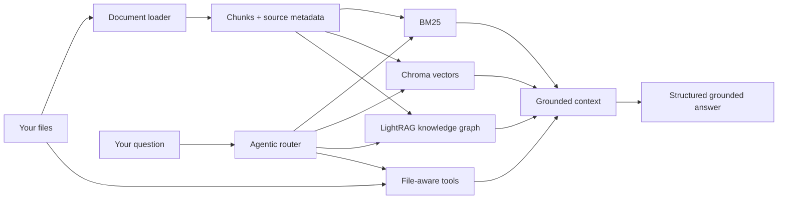

# ContextWeave

> **Your files in. Better answers out.**
>
> An agentic hybrid GraphRAG system that finds the right evidence across keywords, meaning, relationships, and files.

The name describes the core idea: weaving together keyword search, semantic search, knowledge-graph retrieval, agentic tool use, and direct file exploration. The package name remains `hybrid-rag` for now, so existing commands continue to work.

## Why does this exist?

Large language models are good at generating answers, but they do not automatically know the contents of your private documents. A basic RAG system can still miss answers when:

- the user asks for an exact identifier, class name, or phrase;
- the question uses different words from the source document;
- the answer depends on relationships between people, systems, or concepts;
- the relevant evidence is spread across many files;
- the collection is too large to send to the model in one prompt.

ContextWeave solves this by indexing your data once, selecting the retrieval method and tools that fit the question, and giving the language model relevant source material instead of the entire dataset.

## What it has

| Capability | What it adds | Useful for |
| --- | --- | --- |
| BM25 search | Exact keyword matching | IDs, names, code symbols, error messages |
| Chroma vector search | Semantic similarity | Natural-language questions and paraphrases |
| LightRAG GraphRAG | Entity and relationship-aware retrieval | Connected facts and multi-hop questions |
| Agentic routing | Chooses tools and retrieval modes per question | Mixed workloads and complex requests |
| File-aware tools | Folder exploration and targeted file reading | Large codebases and deep file analysis |
| Chunking | Splits long documents into retrievable sections | Manuals, reports, source code, exports |
| Source metadata | Keeps relative file paths with retrieved content | Traceable answers and citations |
| Structured generation | Follows prompts and output schemas | JSON and other generated artifacts |
| Configurable providers | Local Ollama or hosted OpenAI-compatible LLMs | Private, local, or cloud deployments |
| Reusable indexes | Stores Chroma and LightRAG indexes on disk | Faster follow-up questions |

## How it works



In short, this is not only “retrieve documents and generate an answer.” It is a **multi-strategy agentic RAG system** that can combine lexical retrieval, semantic retrieval, graph retrieval, file tools, and structured output generation.

<details>
<summary><strong>Which retrieval strategy should I choose?</strong></summary>

| Strategy | Choose it when | Index command |
| --- | --- | --- |
| `lightrag` | You need GraphRAG answers with entities and relationships | `uv run python lightrag_ingest.py` |
| `hybrid` | You need fast keyword + semantic search | `uv run python ingest.py` |
| `agentfs` | You need file-aware exploration and multi-file analysis | No vector index required |
| `auto` | You want agentic routing across all available tools | Run both ingestion commands |

Set the choice in `.env` with `STRATEGY=...`. The default is `lightrag`.
</details>

## What data can it use?

This project is not tied to the example Android UI dataset. Use it with:

- source code and technical repositories;
- product documentation, manuals, and support content;
- research notes, reports, and policies;
- CSV, JSON, YAML, XML, and SQL exports;
- mixed folders containing several document types.

Supported extensions:

`txt`, `md`, `py`, `js`, `ts`, `java`, `c`, `cpp`, `h`, `html`, `css`, `json`, `yaml`, `yml`, `xml`, `csv`, `sql`, `kt`, `pdf`, `docx`, `pptx`, and `xlsx`.

Put files in `context/`, or point the pipeline to another folder with `CONTEXT_FOLDER`. The `context/` folder is intentionally ignored by git because it may contain private datasets. Relative paths are retained as source metadata so answers can identify where evidence came from.

<details>
<summary><strong>Example datasets and questions</strong></summary>

| Dataset | Example question |
| --- | --- |
| API documentation | “Which endpoint updates a user’s profile and what fields are required?” |
| Source code | “Where is retry behavior configured, and which services use it?” |
| Company policies | “What is the approval process for an expert-level rating?” |
| Research papers | “Which studies compare these two approaches?” |
| Spreadsheets | “Summarize the revenue change by region and cite the source sheet.” |
</details>

## Quick start

### 1. Install dependencies

Python 3.11 or newer is required. [`uv`](https://docs.astral.sh/uv/) is recommended:

```bash
uv sync
```

### 2. Choose a model provider

The default setup uses [Ollama](https://ollama.com/) locally:

```bash
ollama pull nomic-embed-text
ollama pull gpt-oss:20b-cloud
```

Copy the environment template and edit it when needed:

```powershell
Copy-Item .env.example .env
```

On macOS/Linux:

```bash
cp .env.example .env
```

`.env` is ignored by git. Never put a real API key in `.env.example`.

<details>
<summary><strong>Hosted OpenAI-compatible LLM configuration</strong></summary>

Set these values in `.env`:

```dotenv
LLM_BASE_URL=https://your-provider.example/v1
LLM_API_KEY=replace-with-your-api-key
LLM_MODEL=your-model-name
LIGHTRAG_LLM_BASE_URL=https://your-provider.example/v1
LIGHTRAG_LLM_API_KEY=replace-with-your-api-key
LIGHTRAG_LLM_MODEL=your-model-name
```

Embeddings use the Ollama-compatible embedding settings by default.
</details>

### 3. Add your dataset

Place documents below `context/`, or configure a separate folder:

```dotenv
CONTEXT_FOLDER=C:/data/my-knowledge-base
```

### 4. Build an index

For keyword + semantic retrieval:

```bash
uv run python ingest.py
```

For LightRAG GraphRAG entity and relationship retrieval:

```bash
uv run python lightrag_ingest.py
```

For complete `auto` coverage, run both commands.

### 5. Ask questions

Edit the `user_request` in `main.py` with a question about your dataset, then run:

```bash
uv run python main.py
```

The generated answer is saved in `output/`. The console also reports indexing, retrieval, and token-usage information.

<details>
<summary><strong>Re-indexing behavior</strong></summary>

By default, ingestion rebuilds the relevant local index:

```dotenv
FRESH_INDEX=true
FRESH_LIGHTRAG_INDEX=true
```

Set either value to `false` when you want to preserve an existing index. Use separate storage directories when working with unrelated collections.
</details>

## Project layout

```text
context/              Your source data
instructions/         Prompt and output-schema files used by the example
config.py             Environment-backed configuration
document_loader.py    File discovery and PDF/DOCX/PPTX/XLSX loading
ingest.py             BM25 + Chroma ingestion
lightrag_ingest.py    LightRAG graph ingestion
hybrid_retriever.py   BM25 + vector retriever construction
agentfs_manager.py    File exploration and batched reading tools
rag_pipeline.py       Agentic routing and answer orchestration
main.py               Example query runner
chroma_db/            Generated Chroma index; ignored by git
lightrag_storage/     Generated LightRAG index; ignored by git
output/               Generated answers; ignored by git
```

## Configuration at a glance

| Variable | Purpose | Example |
| --- | --- | --- |
| `STRATEGY` | Selects retrieval behavior | `lightrag` |
| `CONTEXT_FOLDER` | Dataset directory | `context` |
| `LLM_BASE_URL` | OpenAI-compatible chat endpoint | `http://localhost:11434/v1` |
| `LLM_MODEL` | Generation model | `gpt-oss:20b-cloud` |
| `EMBEDDING_MODEL` | Embedding model | `nomic-embed-text:latest` |
| `CHUNK_SIZE` | Approximate chunk length | `1000` |
| `CHUNK_OVERLAP` | Overlap between chunks | `200` |
| `BM25_WEIGHT` / `VECTOR_WEIGHT` | Hybrid retrieval balance | `0.4` / `0.6` |

See [.env.example](.env.example) for the complete template.

## Troubleshooting

<details>
<summary><strong>Common fixes</strong></summary>

- **No documents found:** check `CONTEXT_FOLDER` and confirm the file extension is supported.
- **No Chroma results:** run `uv run python ingest.py` before using `STRATEGY=hybrid` or `auto`.
- **No LightRAG results:** run `uv run python lightrag_ingest.py` before querying.
- **Ollama connection errors:** start Ollama and verify models with `ollama list`.
- **Hosted API errors:** check that the endpoint includes `/v1`, the key is valid, and the model is available.
- **Stale answers:** rebuild the relevant index after changing the dataset.
</details>

## Security and git hygiene

Do not commit `.env`, API keys, `context/`, `chroma_db/`, `lightrag_storage/`, generated indexes, or private datasets unless you intentionally want to publish them. Review `git status` before your first commit.

## License

Add the license that matches how you plan to distribute this project.
